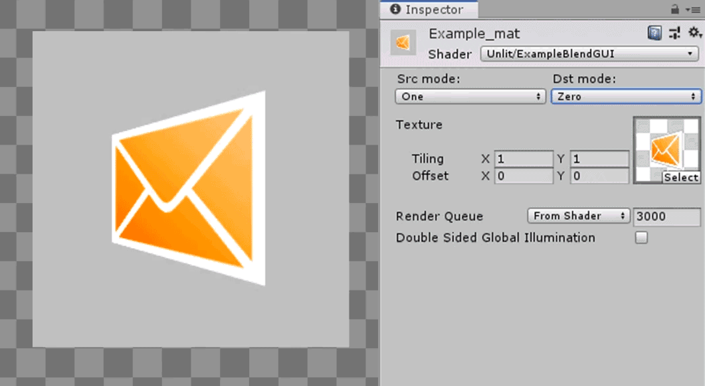

# Unity-shader-blend-GUI
Small and simple custom material editor which can be easily added to any kind of vert frag shader on top of default material GUI. I found it pretty useful especially in prototyping of any kind of VFX based on custom shaders

# Example material inspector prewiev

Example in repo basicaly is just slightly modified default unlit shader. But you can pretty easily use same approach with any kind of custom vert frag shader Despite the fact that Unity already have default Particles/Standard Unlit shader, I found it useful to be able switch blend modes of on the fly from inspector especialy in cases when I need to use same custom shader with differend blend modes.
## Traditional transparency

# How to use
You can find shader GUI called "BlendGUI.cs" here "Assets\Scripts\Editor\".
NOTE: If you want to change it's location in your project folder for any type of custom editors should be called "Editor" 

### 1) Add this properties to your shader property block

    Properties
    {
    ...
		[HideInInspector] _SrcBlend("__src", Float) = 1.0
		[HideInInspector] _DstBlend("__dst", Float) = 0.0
    ...
    }
### 2) Most likeley your subshader Tags should look like this 
    SubShader
    {
    Tags { "Queue" = "Transparent" "RenderType" = "Transparent" "IgnoreProjector" = "True" "PreviewType" = "Plane" }		
    ...
### 3) Make blend use "_SrcBlend" and "_DstBlend" properties and turn ZWrite off
    Blend[_SrcBlend][_DstBlend]
    ZWrite Off
### 4) Add custom material editor to your shader 
    ...
    CustomEditor "MaterialBlendGUI"
    }

That's it. Look for example in SampleScene
